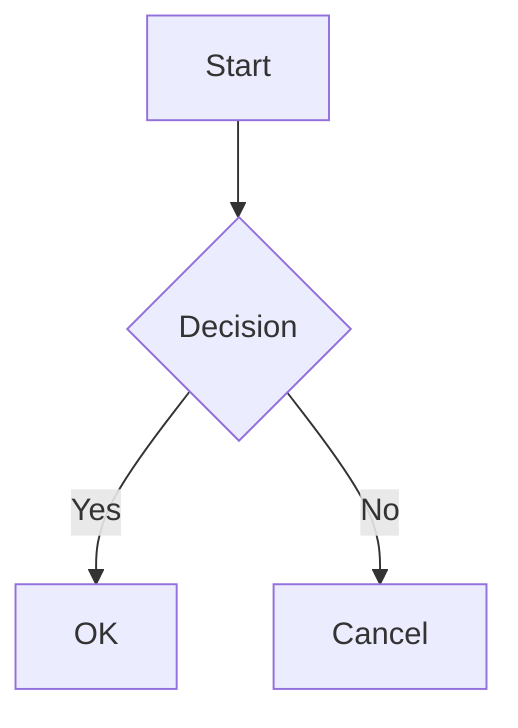

# Plugin Test Page

## Superscript & Subscript

- Superscript: 19^th^
- Subscript: H~2~O

## Table of Contents

[[TOC]]

## Insert & Mark

- Insert: ++Inserted text++
- Mark: ==Marked text==

## Math (KaTeX)

Inline: $\sqrt{3x-1}+(1+x)^2$

Block:

$$
\int_{-\infty}^{\infty} e^{-x^2} dx = \sqrt{\pi}
$$

## Mermaid

## Abbreviation

\*[HTML]: Hyper Text Markup Language

The HTML specification is maintained by W3C.

## Definition List

Term 1
: Definition 1

Term 2
: Definition 2a
: Definition 2b

## Footnote

This is a footnote[^first].

[^first]: This is the first footnote.
